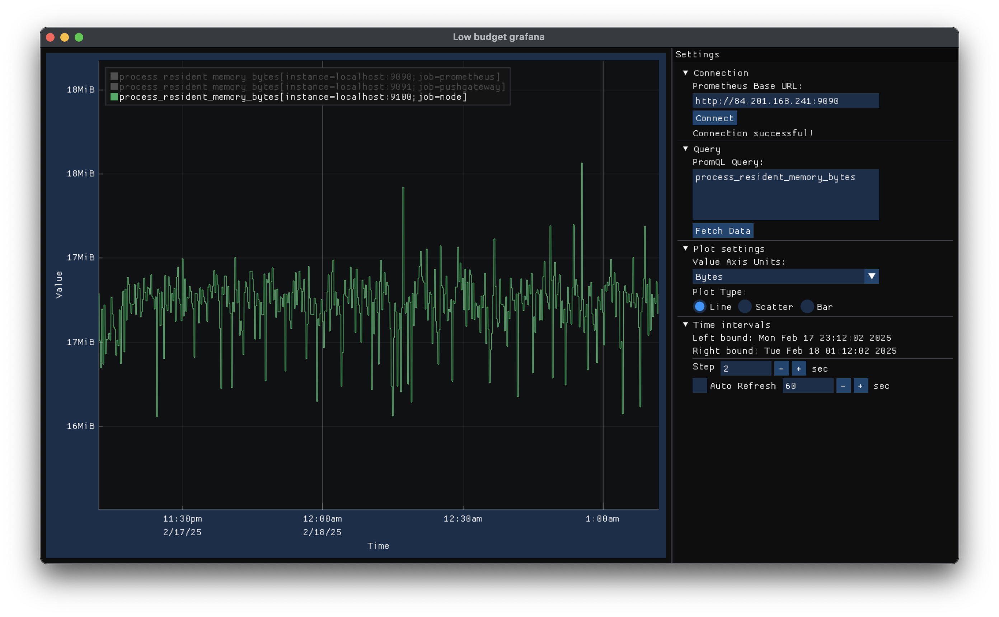

# low-budget-grafana
### Grafana на минималках
...или ПО для визуализации временных рядов (метрик)

#### [Тех. задание](techspec.md)

#### [Документация](https://sssemion.github.io/low-budget-grafana/)

#### [Актуальный отчет](Сироткин_Семен_БПМ_21_2_v250307_02.pdf)

### Скриншоты





### Иснтрукция по сборке и запуску

1.	Склонировать репозиторий
```bash
git clone https://github.com/sssemion/low-budget-grafana.git
cd low-budget-grafana
```
2.	Собрать проект
```bash
cmake -S src -B build -DCMAKE_BUILD_TYPE=Debug -DTEST=ON
cmake --build build
```
3.	Запустить unit-тесты:
```bash
cd build && ctest
```
4.	Запустить приложение:
```bash
./bin/app
```
